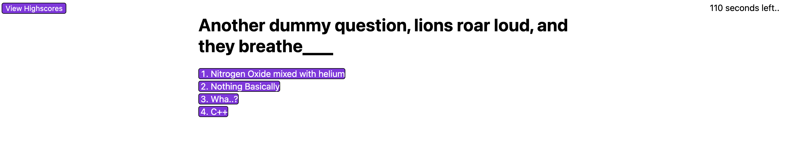

# Coding-Challenge
A coding challenge webapp created with HTML, CSS and Vanilla JS. Well, not really a "coding challenge", rather a mock of the concept.

### Built With

* HTML5
* CSS3
* JavaScript ES6

## Project Highlights

* The use of DOM Tree Strructure with vanilla javaScript to manipulate and add elements to the page's HTML
* The use of timers and setTimeOut Method

## Description

- After quiz begins a timer starts a count down from 120 seconds
- User goes through a series of questions, answers either increase final score or decreases remaining time depending on choosing the correct answer
- After the quiz ends, user enters their initials, and submits it
- Their initials are added to the high score table along with their scores, with the option to start again or clear the scores

## Features

- Includes a set of question and their answers in a unifrom object that can be extended to include more questions
- Notifies the user if they answered correctly or incorrectly via a timed message that appears at the bottom
- Selects questions at random from the given set, ensuring that no question is selected twice
- Ends the quiz in case time runs out
- Accepts several entries to the highscore board
- Gives the option to the user to clear the highscore board or restart the quiz
- Enables the user to check the highscore board mid quiz and come back to the same question

## Getting Started

This is an example of how you may give instructions on setting up your project locally.
To get a local copy up and running follow these simple example steps.

### Prerequisites

A web browser.

### Installation

Not Required.

## Screenshots of product journey

#### MCQs appearing in the middle, with timer to the left counting down and highscores button to the right

#### User answers, and a timed comment appears below, vanishing after 2 seconds

#### Quiz ends, user is prompted to enter initials to be added to the highscores table

#### Highscores table

#### User choosing to clear the table

